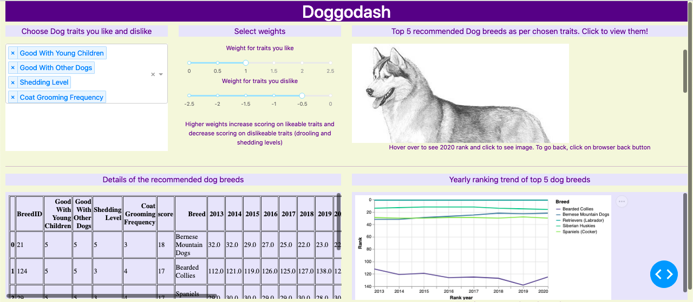

# Steven Leung

-   [LinkedIn Profile](https://www.linkedin.com/in/stevenleung08/)
-   Here is a list of my technical projects:

## [Doggodash](http://dsci532-2022-group18-py.herokuapp.com)

 - [GitHub repo](https://github.com/UBC-MDS/doggodash)

## EDAhelper

-   Python and R packages to make Exploratory Data Analysis (EDA) easier by simplifying 4 common EDA tasks into one-line codes.
-   Presentation deck in PDF format is [here](https://github.com/stevenleung2018/stevenleung2018.github.io/blob/77ac25232f19d6b2ec48745d14a83804fd569da7/docs/542_group5_EDAhelper.pdf)
-   Documentation of the Python package can be seen [here](https://pypi.org/project/edahelper/).
-   The GitHub repo for the Python package is [here](https://github.com/UBC-MDS/EDAhelper).
-   Documentation of the R package can be see [here](https://ubc-mds.github.io/EDAhelperR/index.html).
-   The GitHub repo for the R package is [here](https://github.com/UBC-MDS/EDAhelperR).
